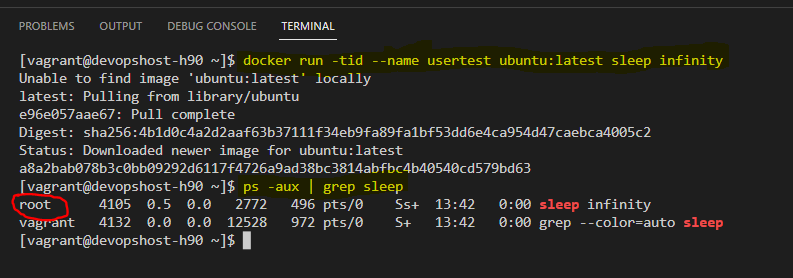

# Docker Security

- When working with docker, security can be very complex to manage.
- So we will see some tips to manage security with docker.

## 1. with docker, containers are usually launched with the root user. which is a security problem. 

- highlighting the execution of containers for the root user 
    * we will launch a container with an __ubuntu image__, then execute in this container the sleep command, so that a process remains active continuously in the container
    ```sh
    docker run -tid --name usertest ubuntu:latest sleep infinity
    ps -aux | grep sleep
    ```

    we can see that the container is executed by the __root user__, which is a safety issue

    

    #### Solution to the security problem:

To solve this problem, the principle is as follows: 
1. create a group, then create a user 
2. add the user to the group
3. edit the file /etc/docker/daemon.json to add this user
4. reload the docker daemon, then restart the docker service

To do all these actions, run the script below, it is located in the security directory of this repository

```sh
#!/bin/bash

###############################################################
#  AUTEUR:   HERMANN90
#
#  DESCRIPTION:  creation of a user specified for docker to manage the security
###############################################################


groupadd -g 500000 dockremap && 
groupadd -g 501000 dockremap-user && 
useradd -u 500000 -g dockremap -s /bin/false dockremap && 
useradd -u 501000 -g dockremap-user -s /bin/false dockremap-user

echo "dockremap:500000:65536" >> /etc/subuid && 
echo "dockremap:500000:65536" >>/etc/subgid

echo "
  {
   \"userns-remap\": \"default\"
  }
" > /etc/docker/daemon.json

systemctl daemon-reload && systemctl restart docker
```