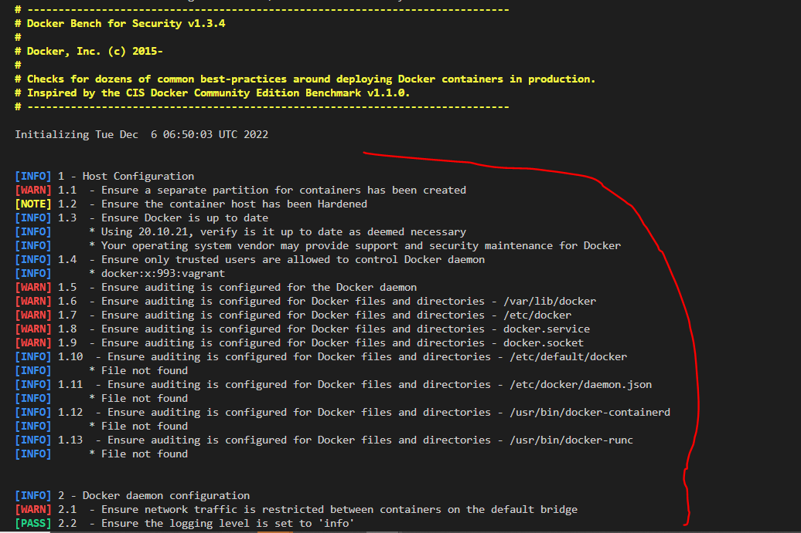

# Docker Security

- When working with docker, security can be very complex to manage.
- So we will see some tips to manage security with docker.

## 1. with docker, containers are usually launched with the root user. which is a security problem. 

- highlighting the execution of containers for the root user 
    * we will launch a container with an __ubuntu image__, then execute in this container the sleep command, so that a process remains active continuously in the container
    ```sh
    docker run -tid --name usertest ubuntu:latest sleep infinity
    ps -aux | grep sleep
    ```

    we can see that the container is executed by the __root user__, which is a safety issue

    

    #### Solution to the security problem:

To solve this problem, the principle is as follows: 
1. create a group, then create a user 
2. add the user to the group
3. edit the file /etc/docker/daemon.json to add this user
4. reload the docker daemon, then restart the docker service

To do all these actions, run the script below, it is located in the security directory of this repository

```sh
#!/bin/bash

###############################################################
#  AUTEUR:   HERMANN90
#
#  DESCRIPTION:  creation of a user specified for docker to manage the security
###############################################################


groupadd -g 500000 dockremap && 
groupadd -g 501000 dockremap-user && 
useradd -u 500000 -g dockremap -s /bin/false dockremap && 
useradd -u 501000 -g dockremap-user -s /bin/false dockremap-user

echo "dockremap:500000:65536" >> /etc/subuid && 
echo "dockremap:500000:65536" >>/etc/subgid

echo "
  {
   \"userns-remap\": \"default\"
  }
" > /etc/docker/daemon.json

systemctl daemon-reload && systemctl restart docker
```

#### execution step : 
- go to the security directory
- give execution rights to the file docker_secure_user.sh
- execute the file docker_secure_user.sh
- delete the containers
- restart our ubuntu container with the sleep command
- then do a grep to see that it's the user create  that has launched the container and not the root user. 

```sh
cd security
chmod 777 docker_secure_user.sh 
sudo ./docker_secure_user.sh

```

##  Docker Bench for Security
- Checks for dozens of common best-practices around deploying Docker containers in production.
- Inspired by the CIS Docker Community Edition Benchmark v1.1.0.

To get a set of information on how to secure your docker infrastructure, copy and run the NNN image below. 
You have the list of different actions to watch for to make your docker infrastructure secure. 

```sh
docker run -it --net host --pid host --userns host --cap-add audit_control \
    -e DOCKER_CONTENT_TRUST=$DOCKER_CONTENT_TRUST \
    -v /var/lib:/var/lib \
    -v /var/run/docker.sock:/var/run/docker.sock \
    -v /usr/lib/systemd:/usr/lib/systemd \
    -v /etc:/etc --label docker_bench_security \
    docker/docker-bench-security
```

 We can see the list of actions to perform to secure our docker infrastructure




# Tags

* tags = very important for versioning (security)

```
docker tag <image_source>:<version>  <images_dest>:<version>
```

* optimization = 2 tags (v1.0 and latest)

# push / pull

### if registry by default (docker hub): 
  - use this command to log in. this assumes that you have created an account in docker hub (https://hub.docker.com/)
  - put you're docker login
  - type the password
```
docker login
```


### if particular registry

```
docker login <registry_path>
```

### push
```
docker push <registry><image_name>:<version>
```

### pull
```
docker pull <registry><image_name>:<version>
```

# Practice : Tag, Push and Pull

Create a dockerfile, containing the instructions below. 

#### Note : the base image is the frontend image of an application we are working on

- use the vi command, then copy and paste the content below. save then check that your Dockerfile is created in the directory where you are. 
```sh
mkdir push_and_pull
cd push_and_pull
sudo vi Dockerfile
ls
```

- __Dockerfile content__
```sh
FROM alpine:latest
LABEL maintener Hermann90
```

1- generate a docker image from this Dockerfile

```sh
docker build -t myownimage .
docker images
```

2- tag this image with a v1.0 version
3- put this image in your docker registry
```sh
docker tag myownimage:latest hermann90/myownimage:v1.0
docker push hermann90/myownimage:v1.0
docker images
```


4- check that the image is present in your docker registry then, write a docker command to delete all the docker images and all the containers in your machine
6- perform a pull of your docker image
7- check that your image is now present in your machine. 

```sh
docker rm -f `docker ps -aq`
docker rmi -f `docker images -q`
docker images
docker pull hermann90/myownimage:v1.0
```