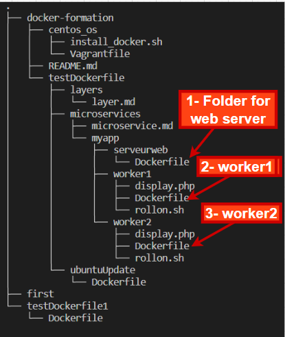

### Microservices principles and demo using Docker images

#### Microservices Interest : 

* split to better control the environment
	- network
	- version of services
	- ...

* split to adapt the resources
	example :
	- more workers : produce more
	- more web servers : receive  user requests
  - independently

* increase the speed of deployment

* reduce single point of failure (SPOF)

### Example :
We are going to implement the concept of microservice with docker images. it is a simple example for pedagogy, we must have : 
- a web page index.html that will display the information that are calculated in two other services
- two variables calculated in two different services.

#### Solution:
* 3 containers
	- 1 nginx web server (page display)
	- 2 php containers (workers) => 1 per variable

##### The Web Container

* Dockerfile
```
FROM ubuntu:latest
RUN apt-get update
RUN apt-get install -y nginx
VOLUME /var/www/html/
ENTRYPOINT ["nginx", "-g", "daemon off;"]
```

-------------------------------------------------

##### The workers

* Dockerfile

```
FROM php:7.2-cli
COPY rollon.sh /
COPY display.php /
RUN chmod 755 /rollon.sh
ENTRYPOINT ["./rollon.sh"]
```


-------------------------------------------------

###### Scripts rollon.sh 
This script is a PHP script, which allows to increment a variable of 100, then to save its value in a file called __worker1.txt__

```
#!/bin/bash
x=1
while true
do
echo $x > /var/www/html/worker1.txt
((x=x+100))
php /display.php
sleep 10
done
```

-------------------------------------------------

###### Script display.php
php script, which displays the values in each file written by each container worker

```
<?php
$file1='/var/www/html/worker1.txt';
$file2='/var/www/html/worker2.txt';
$Data1="";
$Data2="";

# worker1 data
if (file_exists($file1)) {
$fh = fopen($file1,'r');
while ($line = fgets($fh)) {
  $worker1 = $line;
}
fclose($fh);
}
```

-------------------------------------------------

```
# worker2 data
if (file_exists($file2)) {
$fh = fopen($file2,'r');
while ($line = fgets($fh)) {
  $worker2 = $line;
}
fclose($fh);
}

# display
$File = "/var/www/html/index.html";
$Handle = fopen($File, 'w');
$Data1 = "worker 1 is ".$worker1."\n";
fwrite($Handle, $Data1);
$Data2 = "worker 2 is ".$worker2."\n";
fwrite($Handle, $Data2);
fclose($Handle);
```

## execution and testing of our services

### Process : 
1. 
