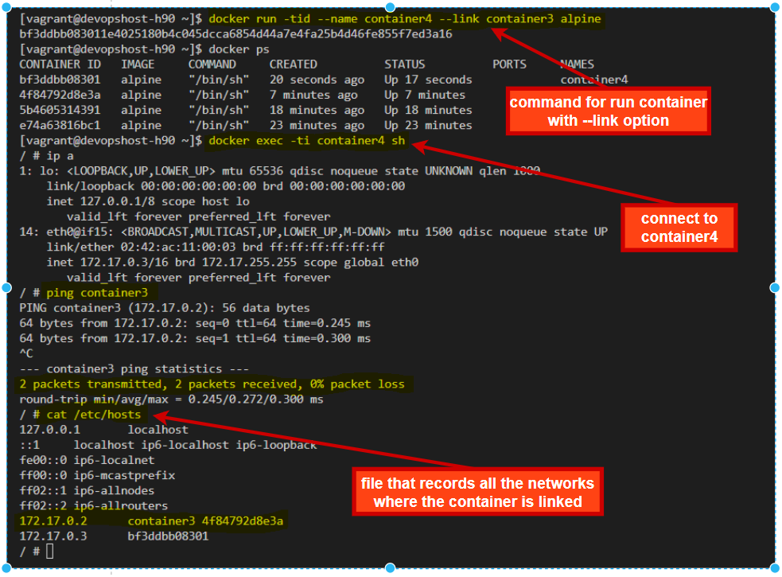

### Principaux
=========

##### Bridge

* defauld network
	- 172.17.0.0/16

*  communication between containers

* covers many needs

* beware: non-fixed ip's
	- use the container name


---------------------------------------------------------------------------


#### Bridge customization

__Create Network__
```
docker network create -d bridge --subnet 172.30.0.0/16 mynetwork
```

__Use our custom Network__
```
docker run -tid --name container1 --network mynetwork alpine
```


---------------------------------------------------------------------------


- Other cases: __--net__

* --net : none

* --net : host

* --net : container:<nomconteneur>


- Other cases: __--link__

* --link : container:<nomconteneur>

* add a host in the  __/etc/hosts__ file of the container

---------------------------------------------------------------------------


- Other ways : 

* --add-host <nomhost>:ip 

* --dns : add ip of dns servers 

### Exercise : Network using alpine image
1. create a bridge type network called __mynetwork__ in our machine, then display the information about this network.
2. create two containers (__container1__, __container2__), assigning them the __mynetwork__ using the __alpine image__
3. connect to each container, then : 
    - check its ip address (__ip a__ command)
    - check that container1 is communicating with container2 (using __ping__ command).
4. create another container __container3__ using the default network. connect in this container3 then 
    - Display her ip address, then not that it's something like 172.17.0.2
    - check that this __container3__ does not communicate with the two other containers created above (the ping command failed).
5. create a __container4__, then add the __--link__ attribute to make it communicate with __container3__.
Check the content of the __/etc/hosts__ file of this container, then notice that it has saved the information about __container3__, which allows them to communicate with each other.

### One Solution

```sh
docker network create -d bridge --subnet 172.30.0.0/16 mynetwork
docker inspect mynetwork
docker network ls

# 2- create two containers that use mynetwork
docker run -tid --name container1 --network mynetwork alpine
docker run -tid --name container2 --network mynetwork alpine
docker ps

# 3- connect to each container then check ip address 
docker exec -ti container1 sh
ip a 
ping container2
exit

docker exec -ti container2 sh
ip a
ping container1
exit

# 4- create another container (container3) without network option
docker run -tid --name container3 alpine
docker ps
docker exec -ti container3 sh
ip a
ping container1 ## display ==> ping: bad address 'container1'
ping container2
exit

# 5- create container4 with --link option
docker run -tid --name container4 --link container3 alpine
docker ps
docker exec -ti container4 sh
ping container3
cat /etc/hosts
exit
```

__image for the result explanation__


